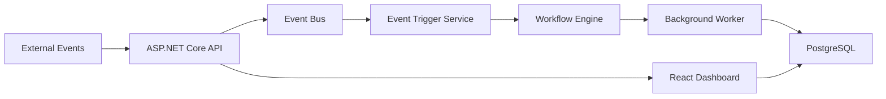

# Dotnetflow

**Route events through multi-step workflows with real-time execution tracking.**

[](https://github.com/dsantoreis/dotnetflow/actions/workflows/ci.yml)
[](https://github.com/dsantoreis/dotnetflow/actions/workflows/ci.yml)
[](./LICENSE)
[](https://github.com/dsantoreis/dotnetflow/releases/latest)
[](https://dsantoreis.github.io/dotnetflow/)

Dotnetflow is a lightweight workflow engine for .NET. Define workflows as JSON, fire events that trigger them automatically, and track every execution step in real time through the API or React dashboard.

---

## Before & After

| | Without Dotnetflow | With Dotnetflow |
|---|---|---|
| **Define a workflow** | Hardcode state machines, rebuild on every change | JSON definition, hot-reload, zero downtime |
| **Trigger execution** | Polling loops, cron hacks, manual API calls | Fire an event, matching workflows start automatically |
| **Track progress** | grep through logs, hope nothing got lost | Real-time execution state: pending > running > completed/failed |
| **Debug failures** | Which step failed? When? What was the input? | Per-step status with timestamps and error context |
| **Operate at scale** | Custom queue management per service | Background worker processes executions continuously |

---

## Quickstart

```bash
git clone https://github.com/dsantoreis/dotnetflow.git
cd dotnetflow
docker compose up --build -d

# Health check
curl http://localhost:8081/health

# Open the ops dashboard
open http://localhost:5173
```

That's it. PostgreSQL, the API, and the React dashboard all come up together.

---

## How it works

```bash
# 1. Create a workflow
curl -X POST http://localhost:8081/api/workflows \
  -H "Content-Type: application/json" \
  -d '{
    "name": "onboard-lead",
    "triggerEvent": "lead.created",
    "steps": ["validate", "enrich", "assign"]
  }'

# 2. Fire an event
curl -X POST http://localhost:8081/api/events \
  -H "Content-Type: application/json" \
  -d '{"type": "lead.created", "payload": {"email": "new@example.com"}}'

# 3. Watch the execution
curl http://localhost:8081/api/executions
# => { "status": "running", "currentStep": "enrich", ... }
```

Events match workflows by `triggerEvent`. When a match hits, the engine creates an execution and the background worker processes each step in sequence.

See [DEMO.md](./DEMO.md) for a full walkthrough with conditional steps and the dashboard.

---

## Architecture



| Layer | Technology |
|-------|-----------|
| API | ASP.NET Core (.NET 10) |
| Database | PostgreSQL + EF Core |
| Frontend | React + TypeScript + Vite |
| Infra | Docker, docker-compose, Kubernetes |
| Tests | xUnit, 35 tests, 86% line coverage |

---

## Project structure

```
api/
  src/DotnetFlow.Api/
    Controllers/       # REST endpoints (Workflows, Events, Executions)
    Services/          # WorkflowEngine, EventBus, EventTriggerService, BackgroundWorker
    Models/            # Domain entities and DTOs
    Data/              # EF Core DbContext
  tests/DotnetFlow.Api.Tests/
    7 test files, 35 tests covering engine, bus, triggers, and all API endpoints
frontend/
  App.tsx              # React ops dashboard with live execution tracking
k8s/                   # Kubernetes deployment, service, ingress
docs-site/             # Astro/Starlight documentation site
```

---

## Deploy

**Docker (recommended):**
```bash
docker compose up --build -d
```

**Kubernetes:**
```bash
kubectl apply -f k8s/
```

**Local development:**
```bash
cd api && dotnet run --project src/DotnetFlow.Api
cd frontend && npm install && npm run dev
```

---

## Testing

```bash
cd api
dotnet test --collect:"XPlat Code Coverage"
# 35 tests, 86% line coverage, ~400ms
```

Coverage threshold is enforced at 80% in CI. Every PR must pass.

---

## Docs

Full documentation is at [dsantoreis.github.io/dotnetflow](https://dsantoreis.github.io/dotnetflow/) covering getting started, architecture deep dive, API reference, and deployment guides.

---

## Roadmap

- [ ] Step-level retry policies with configurable backoff
- [ ] Webhook notifications on execution state changes
- [ ] Workflow versioning (run v1 and v2 side by side)
- [ ] Execution timeline visualization in the dashboard
- [ ] OpenTelemetry tracing integration

---

## Contributing

See [CONTRIBUTING.md](./CONTRIBUTING.md) for guidelines.

## License

MIT. See [LICENSE](./LICENSE).
