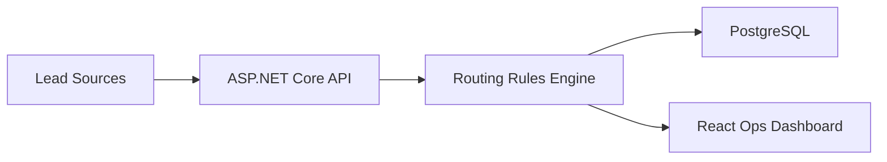

# Dotnetflow

[](https://github.com/dsantoreis/dotnetflow/actions/workflows/ci.yml)
[](./LICENSE)

Route inbound leads to the right pipeline owner with a .NET API and React operations dashboard.

## Quickstart

```bash
docker compose up --build -d
curl http://localhost:8081/health
open http://localhost:5173
```

## Architecture



## Docs

- Getting Started, Architecture, API, Deployment: `docs-site/`

## Deploy

- Docker: `Dockerfile`, `docker-compose.yml`
- Kubernetes: `k8s/`

If this saves your ops team time, star the repo.
