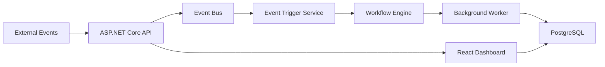

# Dotnetflow

[](https://github.com/dsantoreis/dotnetflow/actions/workflows/ci.yml)
[](./LICENSE)
[](https://github.com/dsantoreis/dotnetflow/releases/latest)

Define workflows as JSON, trigger them with events, and watch executions run through your pipeline. Built with ASP.NET Core, PostgreSQL, and a React ops dashboard.

## What it does

- Define multi-step workflows with trigger conditions
- Fire events that automatically match and start workflow executions
- Track execution state (pending, running, completed, failed) in real time
- Background worker processes queued executions continuously
- In-memory event bus for decoupled, reactive processing

## Quickstart

```bash
git clone https://github.com/dsantoreis/dotnetflow.git
cd dotnetflow
docker compose up --build -d

# Check the API
curl http://localhost:8081/health

# Open the dashboard
open http://localhost:5173
```

## API

```bash
# Create a workflow
curl -X POST http://localhost:8081/api/workflows \
  -H "Content-Type: application/json" \
  -d '{"name": "onboard-lead", "triggerEvent": "lead.created", "steps": ["validate", "enrich", "assign"]}'

# Fire an event
curl -X POST http://localhost:8081/api/events \
  -H "Content-Type: application/json" \
  -d '{"type": "lead.created", "payload": {"email": "new@example.com"}}'

# List executions
curl http://localhost:8081/api/executions
```

## Architecture



### Stack

| Layer | Technology |
|-------|-----------|
| API | ASP.NET Core (.NET 10) |
| Database | PostgreSQL + EF Core |
| Frontend | React + TypeScript + Vite |
| Infra | Docker, docker-compose, Kubernetes |

## Project Structure

```
api/
  src/DotnetFlow.Api/
    Controllers/       # REST endpoints (Workflows, Events, Executions)
    Services/          # WorkflowEngine, EventBus, EventTriggerService, BackgroundWorker
    Models/            # Domain entities and DTOs
    Data/              # EF Core DbContext
  tests/DotnetFlow.Api.Tests/
    7 test files covering engine, bus, triggers, and all API endpoints
frontend/
  App.tsx              # React ops dashboard
k8s/                   # Kubernetes deployment, service, ingress
docs-site/             # Documentation site
```

## Deploy

**Docker:**
```bash
docker compose up --build -d
```

**Kubernetes:**
```bash
kubectl apply -f k8s/
```

## Testing

```bash
cd api
dotnet test
```

## Docs

Full documentation (getting started, architecture, API reference, deployment) is in `docs-site/`.

## Contributing

See [CONTRIBUTING.md](./CONTRIBUTING.md).

## License

MIT. See [LICENSE](./LICENSE).
