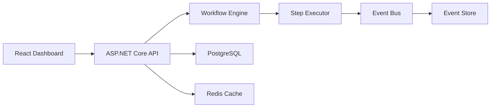

DotnetFlow is an event-driven workflow engine built on .NET 10 with Entity Framework Core and a React management console.

## System Overview

## Core Domain Models

| Model | Purpose |
|---|---|
| **Workflow** | Definition with ordered steps and transitions |
| **WorkflowStep** | Individual step with type (Action/Decision/Wait), handler, and routing |
| **Execution** | Runtime instance of a workflow with state tracking |
| **Event** | Timestamped event with type and JSON payload |

## Design Decisions

**Step Types**: Three step types cover most workflow patterns. Action steps run handlers, Decision steps branch on conditions, Wait steps pause for external events.

**Event Sourcing**: All state changes emit events to the event store, enabling full audit trails and replay capability.

**EF Core + PostgreSQL**: Entity Framework Core with code-first migrations. PostgreSQL for JSONB payload storage and reliable persistence.

## Stack

| Layer | Technology |
|---|---|
| Backend | C# 13, .NET 10, ASP.NET Core |
| ORM | Entity Framework Core 10 |
| Frontend | React 19, Vite, Tailwind CSS |
| Database | PostgreSQL 16 |
| Cache | Redis 7 |
| Container | Docker multi-stage build |
| Orchestration | Kubernetes with health probes |
